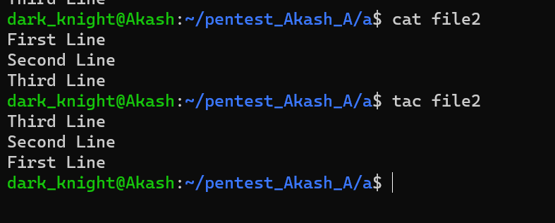

# pentest_Akash_A
## questions 
### 1
1.( a.) Display the path of your current directory
   
   

1.( b.) List out the contents of your current directory

1.( c.) List out the contents of your current directory including hidden files

### 2
( a.) Create a new directory named a

( b.) Move to the newly created directory a

( c.) Create a blank file named “file1”

( d.) Display the file type of “file1”

( e.) Add the line “Hello World” to “file1” using the command echo

( f.) Display the contents of “file1”

( g.) Display the file type of “file1” again

### 3

( a.) Stay in directory a. Create a file “file2” and add the contents below using the  command cat

( b.) Display the contents of “file2”

( c.) Display the contents of “file2” with the lines reversed

### 4

( a.) Stay in directory a. Concatenate the contents of “file1” and “file2” and save them into a new file “file3”

( b.) Display the contents of “file3”

### 5

( a.) Stay in directory a. Create 2 directories b/c with a single command

( b.) Create a new directory d

( c.) Copy the directory d to directory c using a single command

( d.) Delete the directory d in the current directory a

( e.) Copy “file3” to the directory d with a single command

### 5

( a.) Go to directory d and rename “file3” to “file0”

( b.) Stay in the same directory and move “file0” to directory a

### 7

( a.) Go to your home directory

( b.) Create a file named “test” in the directory a/b/c/d

( c.) Stay in the home directory. Find and display the path of “test”

### 8

( a.) Go to directory a. Get the man page of grep and save its contents to a file named “grepman.txt”

( b.) Print the lines containing the word “FILE” (Case sensitive) in the file “grepman.txt”

### 9

( a.) Go to directory a and remove the directory b with a single command

( b.) Remove the files starting with the word “file” with a single command

### 10 

( a.) Go to https://blog.bi0s.in/  and download the logo.png image using wget

(b.) Do the same with python script (Hint : request library)

(c.) Also, display the metadata of the png.

### 11

( a.) Use traceroute on google.com and find list of the IP addresses and hostnames between you and  google.com

( b.) Find  Subdomains,ip addresses of google.com (Tool i will add if you want me to )

### 12

Start a web server on port 8080 with python command

(In any directory and access the files in web browser )

### 13

( a.) Learn about nmap and use that scanner to scan your own machine

( b.) Go to https://tryhackme.com/room/furthernmap and get ip address and

Scan the ip address with (-sS,-sV,-A) in your terminal include all ports

(Hint : start machine )

### 14
( a.) Create a chat application using nc on your local machine with one terminal as server and other as the client

( b.) Transfer a file from server to client (save that file with another name) and display the file.

